# Rails Charts

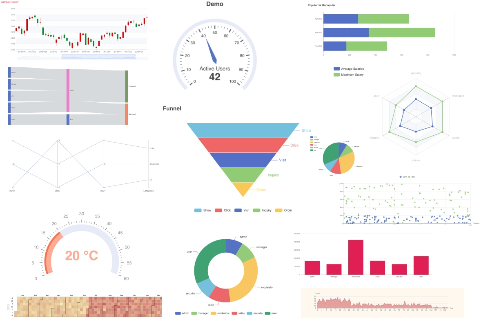

One more gem to build nice charts for your Ruby on Rails application.

It contains useful helpers to build various types of charts of use custom option to build very complex charts using Apache eCharts library.

What you can build with it:

- area chart
- bar chart
- calendar chart
- candlestick chart
- funnel chart
- gauge chart
- line chart
- parallel chart
- donut chart
- pie chart
- radar chart
- sankey chart
- scatter chart
- stacked bar chart
- custom chart

In most cases with one line of code you can have a nice chart. The idea of this gem was inspired by [Charkick](https://github.com/ankane/chartkick) gem which is great and allows you to build charts very quickly. It works the best with cooperation of [groupdate](https://github.com/ankane/groupdate) gem.

But this implementation have more customization options (thanks to more Apache eCharts).

1) add gem in Gemfile, 
```ruby
gem "rails_charts"
```
2) add JS, for example in `application.js`

```js
//= require rails_charts/echarts.min.js
//= require rails_charts/theme/vintage.js
```

Note you can specify different themes.

3) add your first chart 
```ruby
<%= line_chart User.group(:age).count %>
```
4) customize charts if needed. See available options or [official documentation](https://echarts.apache.org/examples/en/index.html). 

## Installation

Add this line to your application's Gemfile:

```ruby
gem "rails_charts"
```

And then execute:
```bash
$ bundle
```

## Options

```ruby
<%= link_chart data, {
  width: '250px',
  height: '250px',
  theme: 'dark',
  class: 'chart-container-class',
  style: 'padding: 10px'
} %>
```

Available options:

width: specify width of the chart
height: specify height of the chart
theme: specify theme of the chart (available themes examples https://echarts.apache.org/en/download-theme.html)
class: specify container's CSS class
id: specify container's ID
style: add inline style
debug: for gem development useful if you want to pause somewhere in the code
vertical: applicable for some types of charts
code: to see output code what is generated to see the chart, useful for debugging
options: {...}, specify additional eCharts options


## Examples

More examples: https://github.com/railsjazz/rails_charts/tree/main/test/dummy/app/views/home.

## Charts

### Area Chart

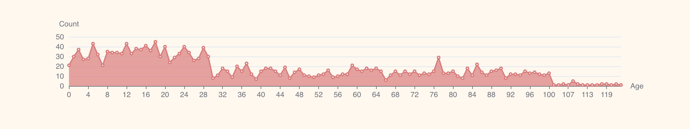

```ruby
<%= area_chart User.distinct.pluck(:role).map{|e| {name: e, data: User.where(role: e).group_by_day(:created_at).count} } %>
```

### Line Chart

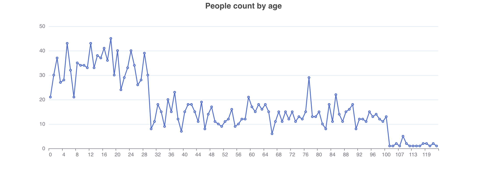

```ruby
<%= line_chart User.group(:age).count, class: 'box', 
  options: {
    title: {
      text: "People count by age",
      left: 'center'
    },
  }
%>
```

### Bar Chart

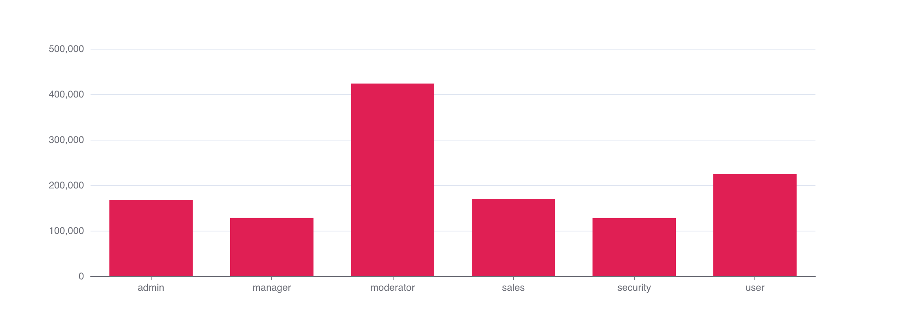

```ruby
<%= bar_chart User.group(:role).average(:age),
  class: 'box',
  theme: 'sakura',
  options: {
    series: { 
      barWidth: '50%'
    },
    tooltip: {
      valueFormatter: RailsCharts::Javascript.new("(value) => '$' + Math.round(value)")
    }
  }
%>
```

### Calendar Chart

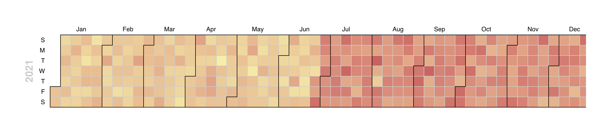

```ruby
<%= calendar_chart Commit.for_calendar_chart,
  class: 'box',
  options: {
    visualMap: {
      show: true,
      min: 0,
      max: 40,
      orient: 'horizontal'
    },
    calendar: [{
      range: '2021',
    },]
  }
%>

```

### Candlestick Chart

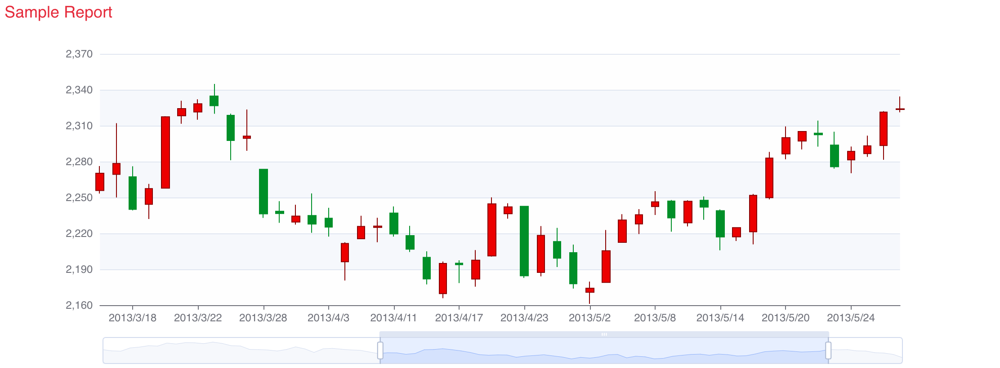

```ruby
<%= candlestick_chart({
    '2017-10-24' => [20, 34, 10, 38],
    '2017-10-25' => [40, 35, 30, 50],
    '2017-10-26' => [31, 38, 33, 44],
    '2017-10-27' => [38, 15, 5, 42]
  },
  class: 'box',
  theme: 'roma',
  options: {
    xAxis: {
      axisTick: {
        alignWithLabel: true
      }
    }
  })
%>
```

### Funnel Chart

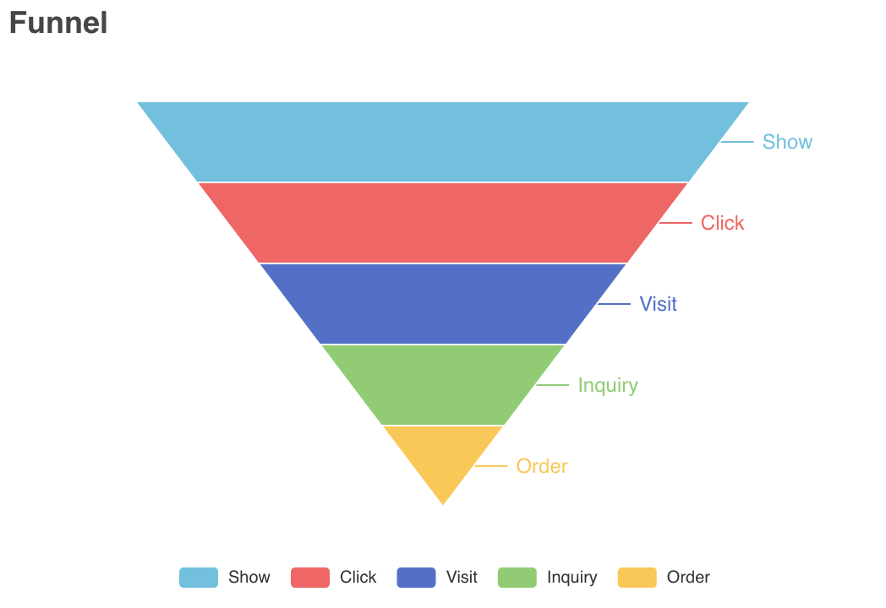

```ruby
<%= funnel_chart User.get_funnel_sample_data,
  class: 'box',
  height: '400px',
  options: {
    title: {
      text: 'Demo',
      left: 'center'
    }
  }
%>
```

### Gauge Chart

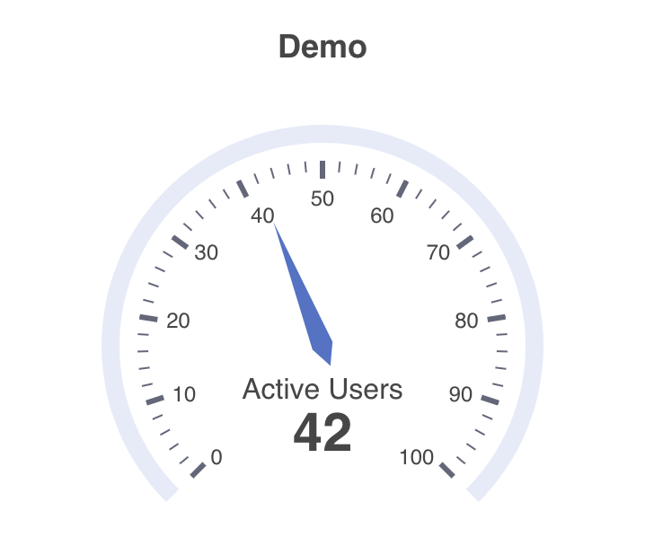

```ruby
<%= gauge_chart User.get_gauge_sample_data,
  class: 'box',
  height: '400px',
  options: {
    title: {
      text: 'Demo',
      left: 'center'
    }
  }
%>
```

### Parallel Chart

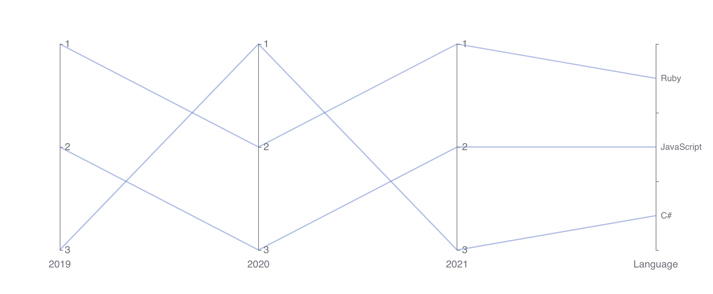

```ruby
<div class="box">
  <%= parallel_chart [
    [1, 2, 1, "Ruby"],
    [2, 3, 2, "JavaScript"],
    [3, 1, 3, "C#"]
  ], {
    options: {
      parallelAxis: [
        { dim: 0, name: '2019', inverse: true, minInterval: 1, min: 1, nameTextStyle: { fontSize: 16 }, axisLabel: { fontSize: 16 } },
        { dim: 1, name: '2020', inverse: true, minInterval: 1, min: 1, nameTextStyle: { fontSize: 16 }, axisLabel: { fontSize: 16 } },
        { dim: 2, name: '2021', inverse: true, minInterval: 1, min: 1, nameTextStyle: { fontSize: 16 }, axisLabel: { fontSize: 16 } },
        { dim: 3, type: "category", name: 'Language', data: ["Ruby", "JavaScript", "C#"], inverse: true, nameTextStyle: { fontSize: 16 }, axisLabel: { fontSize: 14 } },
      ]
    }
  }
  %>
</div>
```

### Donut Chart

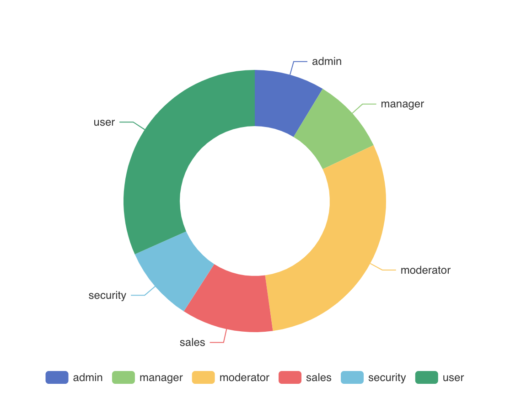

```ruby
<%= donut_chart User.group(:role).count, 
  class: 'box',
  options: {
    legend: {
      bottom: '0'
    },
    emphasis: { 
      itemStyle: {
        shadowBlur: 10,
        shadowOffsetX: 0,
        shadowColor: 'rgba(0, 0, 0, 0.5)'
      } 
    }
  }
%>
```

### Pie Chart

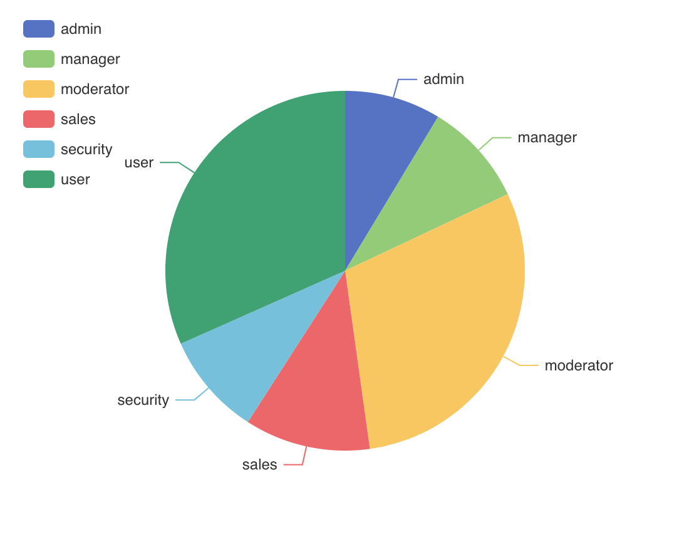

```ruby
<%= pie_chart User.group(:role).count, 
  class: 'box',
  options: {
    legend: { orient: 'vertical', left: 'left' }
  }
%>
```

### Radar Chart

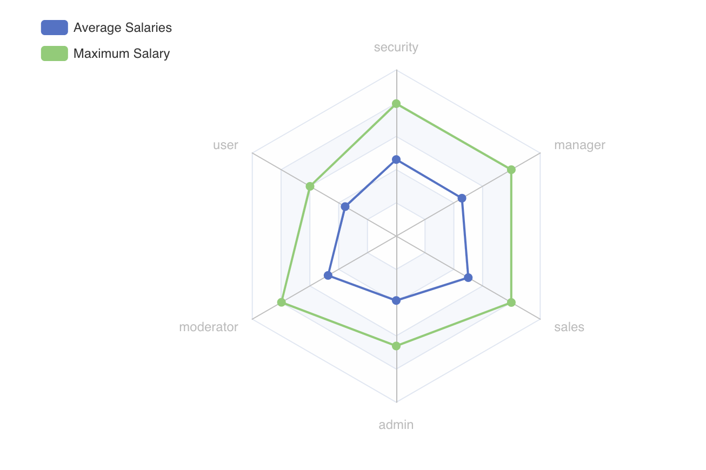

```ruby
<%= radar_chart User.get_data_for_radar_chart,
  class: 'box',
  options: {
    legend: {
      data: ['Average Salaries', 'Maximum Salary'],
      orient: 'vertical',
      left: '20%'
    }
  }
%>
```

### Sankey Chart

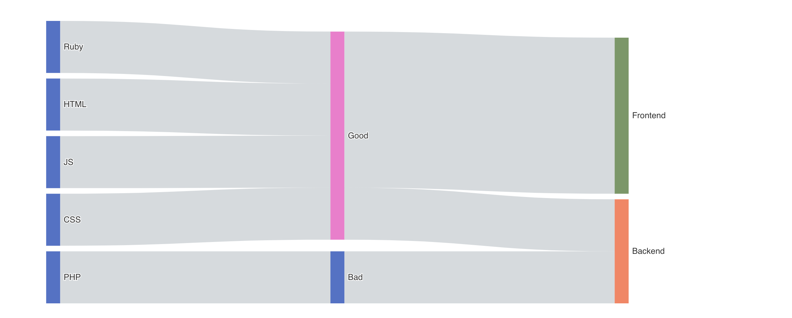

```ruby
<%= sankey_chart({
    data: [
      {name: 'Ruby'}, {name: 'HTML'}, {name: 'JS'}, {name: 'Good'}, {name: 'Bad'}, {name: 'CSS'}, {name: 'PHP'}, {name: 'Frontend'}, {name: 'Backend'}
    ],
    links: [
      {
        source: 'Ruby',
        target: 'Good',
        value: 1
      },
      {
        source: 'HTML',
        target: 'Good',
        value: 1
      },  
      {
        source: 'JS',
        target: 'Good',
        value: 1
      },  
      {
        source: 'CSS',
        target: 'Good',
        value: 1
      },
      {
        source: 'PHP',
        target: 'Bad',
        value: 1
      },
      {
        source: 'Good',
        target: 'Backend',
        value: 1
      },         
      {
        source: 'Good',
        target: 'Frontend',
        value: 3
      },
      {
        source: 'Bad',
        target: 'Backend',
        value: 1
      },             
    ]
  }, {
    options: {

    }
  })
  %>
```

### Scatter Chart

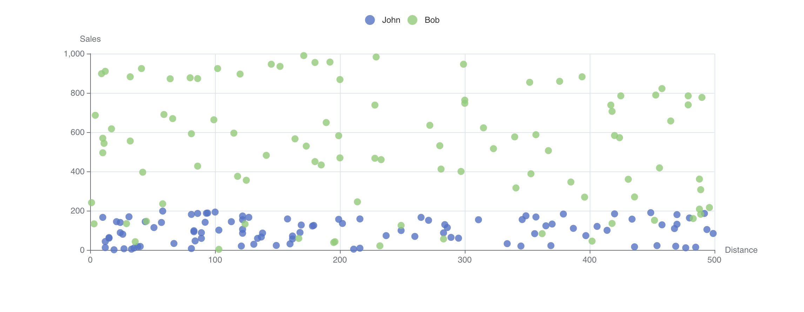

```ruby
<%= scatter_chart [
    { name: 'John', data: User.random_scatter_chart(500, 200) },
    { name: 'Bob', data: User.random_scatter_chart(500, 1000) },
  ],
  {
    class: 'box',
    options: {
      xAxis: {
        name: 'Distance'
      },
      yAxis: {
        name: 'Sales'
      },          
      legend: {
        data: [
          {name: 'John'},
          {name: 'Bob'},
        ]
      },
    },
  }
%>
```

### Stacked bar Chart

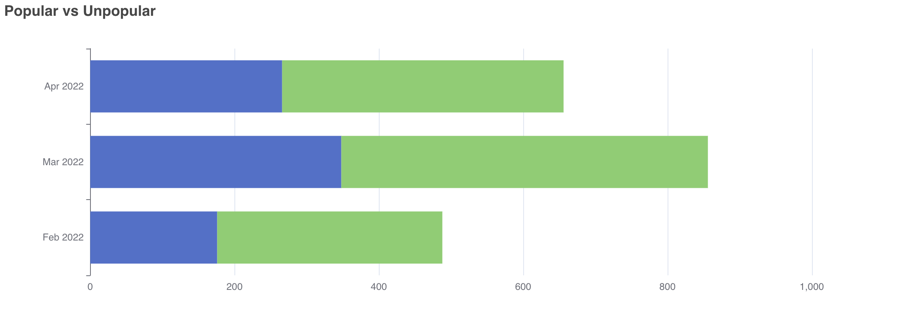

```ruby
<%= stacked_bar_chart [
    { name: 'high priority', data: Account.high_priority.group_by_month(:created_at, format: "%b %Y").count },
    { name: 'low priority', data: Account.low_priority.group_by_month(:created_at, format: "%b %Y").count }
  ],
  {
    options: {
      title: {
        text: "Popular vs Unpopular"
      },
    },
    class: 'box',
    vertical: true
  }
%>
```

### Custom Chart

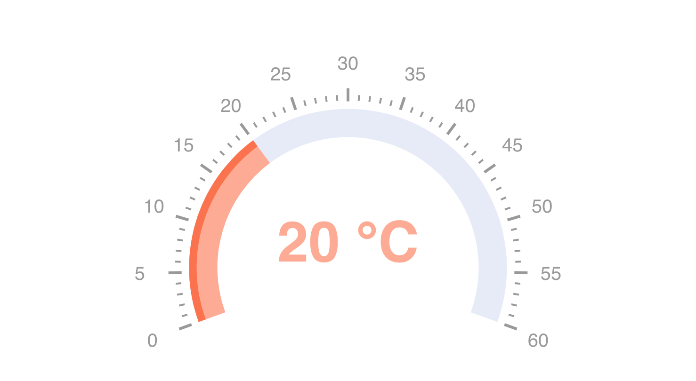

```ruby
<%= custom_chart {...raw JS options ...} %>
```

## Contributing

You are welcome to contributes. Some open tasks:

- importmaps support?
- webpacker support
- add more specs
- add more examples to the dummy app
- customization, options overides, default values?

### Development and testing

`test/dummy/bin/rails s` - to start dummy app.

`rspec` - to run specs.

## License

The gem is available as open source under the terms of the [MIT License](https://opensource.org/licenses/MIT).

Gem is using https://echarts.apache.org/ to build charts.
